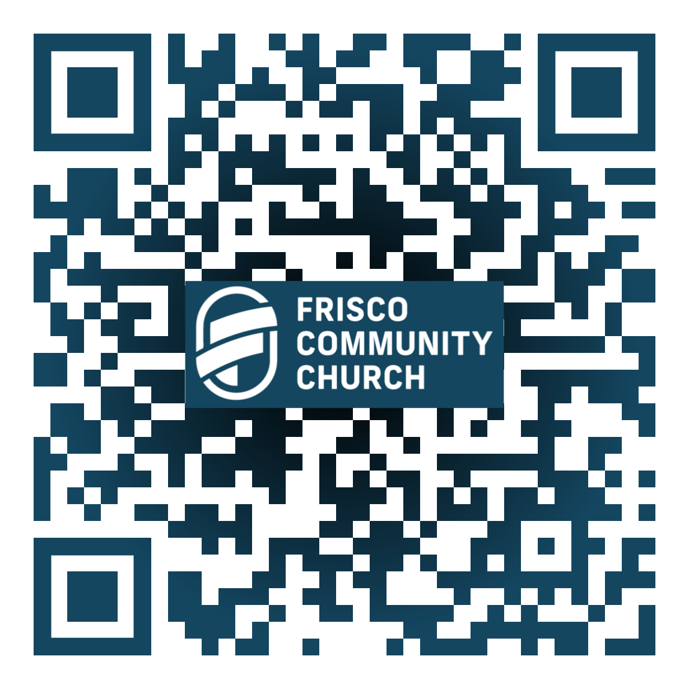

# FCC-lights

[https://kgills.github.io/FCC-lights/](https://kgills.github.io/FCC-lights/)

How to use the FCC lights at LCA.

Kevin Gillespie, kgills@gmail.com

## Contents
* [Power On](#power-on)
* [Opening and Saving](#going-to-cues)
* [Navigating](#navigating)
* [Light Basics](#light-basics)
* [Cues](#cues)
* [Power Down](#power-down)
* [Movers](#movers)

## Power On

## Opening and Saving

## Navigating

## Light Basics

## Cues

## Power Down

## Movers

### Positioning

### Filters