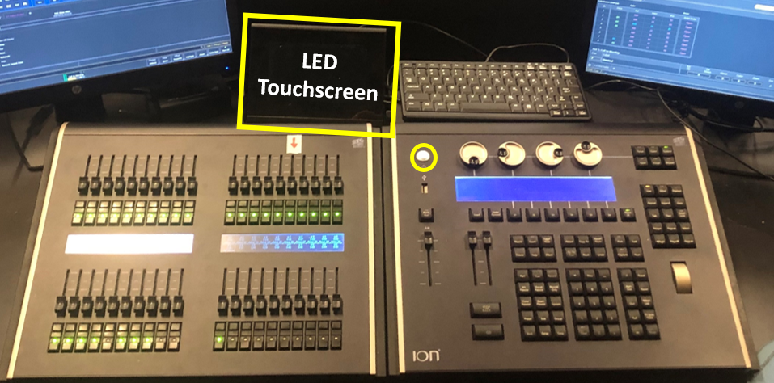
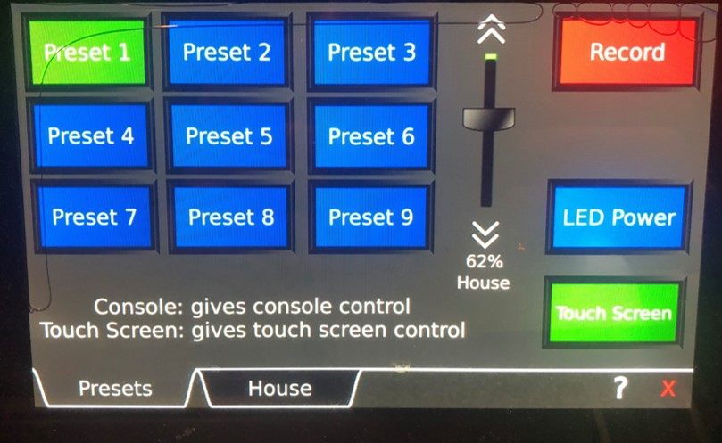
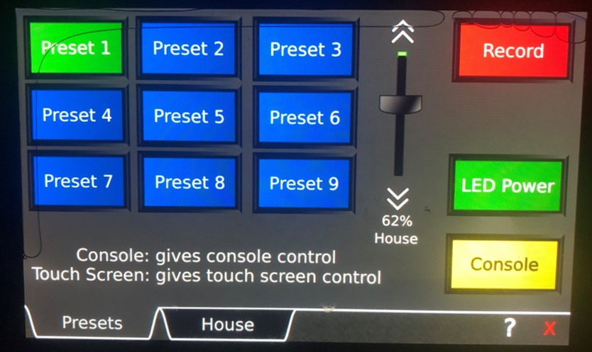
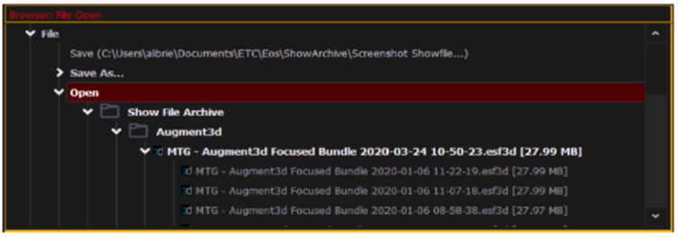
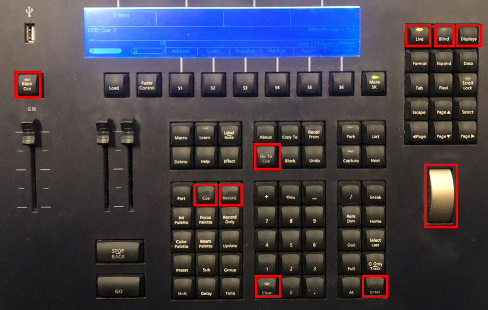
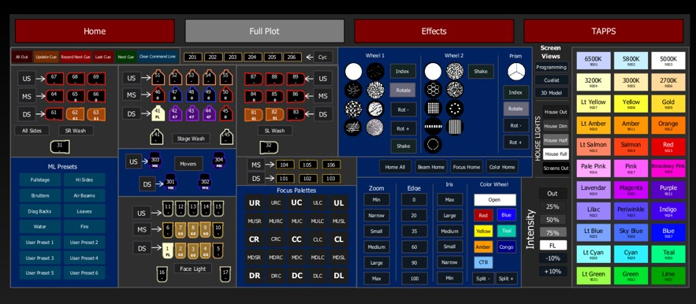
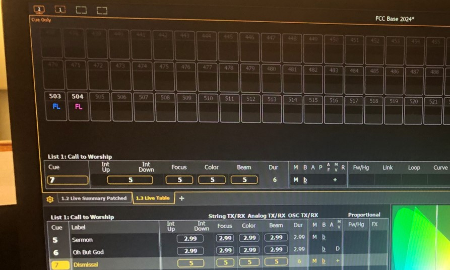

# FCC-lights

How to use the FCC lights at LCA.

[https://kgills.github.io/FCC-lights/](https://kgills.github.io/FCC-lights/)

Kevin Gillespie, <kgills@gmail.com>

This is not a comprehensive guide of the ETC ION Console. This is intended to cover the basics of getting started and setting up a simple light show. It will take some time and experimenting to become familiar. Refer to the documentation in [Resources](#resources) for additional information.

## Contents

* [Power On](#power-on)
* [Open Save Power Off](#open-save-power-off)
* [Snapshots](#snapshots)
* [Console Buttons](#console-buttons)
* [Light Basics](#light-basics)
* [Cues](#cues)
* [Movers](#movers)
* [Effects](#effects)
* [Hints](#hints)
* [Resources](#resources)

## Power On

 Turn on the ION Console with the power button in the top-middle of the console.

 Touch the LED Touchscreen and navigate to the **House** tab. This tab can be used to control the house lights without the ION Console.

Navigate to the **Preset** tab on the LED Touchscreen. Touch **LED Power** until it turns green. This will enable the LED stage lights. Touch the **LED Touchscreen** button until it says **Console**. This will switch control from the LED Touchscreen to the ION Console.

If you're having trouble controlling the lights from the ION Console, make sure the button says **Console**. Either the LED Touchscreen or the ION Console can control the lights, not both.

## Open Save Power Off

Open a previously saved show and use this as a starting point for the next show. Since most of our services are very similar in structure, it's easiest to make small changes to previous shows.

Use the browser on the left screen to open and save shows. **File > Open > Show File Archive**. If you're having trouble finding the browser, press the **Displays** button on the ION Console. Look for the shows labeled with **FCC**. Since other organizations use the same equipment, there will be other shows saved here.

 **File > Save** to save the show at the end of the service. You can **File > Save As** to save to a new location.

In the browser menu select **Power Off Device**. A dialogue box opens asking you to confirm. **DO NOT** use the power button on the ION Console to power off.

## Snapshots

There are lots of menus, options, and tabs that can get overwhelming. Snapshots are record targets that store the current state of the ION external monitor configuration. These can then be recalled to instantly reset the displays to the state stored in the snapshot.

When snapshots are recorded, you can view them in the snapshot list. To view the list, Select the Pop-up Snapshot Browser from the top-right menu icons. It looks like a camera.

## Console Buttons

Important buttons on the ION Console. Most of these buttons will setup a command in the command line that requires the enter button to execute.

* **Blackout**: Turns out all the lights.
* **Live**: Indicates that the changes being made will happen live.
* **Blind**: Changes being made will not be made until you press the **Live** button.
* **Displays**: Brings up the browser.
* **Go To Cue**: Used to recall Cues.
* **Record & Cue**: Used to record Cues.
* **Level Wheel**: Used to control levels such as light intensity.
* **Clear**: Clear our selections or anything in the command line.
* **Enter**: Executes the command.

## Light Basics

Most of the lights can change colors and intensity. The house lights can only change intensity, they are always the same color. Use the **MS 2.1 "Full Plot"** tab to select the lights. You can select multiple lights or groups at the same time by left clicking the lights. The channel numbers and groups will appear in the command line.

Use the **Clear** button or **Backspace** on the keyboard to clear out the command line and start over.

Once you have the light(s) or group(s) selected, choose the desired color on the right. Use the **Level Wheel** to change the intensity.

House light intensity can be controlled in the **MS 2.1 "Full Plot"** tab. This will set the intensity for all of the house lights. Control them individually using the **Channels** tab on the right screen.

* 500: Front, closest to the stage
* 501: Middle
* 502: Rear
* 503: Sides
* 504: Isle

## Cues

Cues are used to store the state of the lights. This allows us to setup the lights for different parts of the show and easily switch between them. Cues do not have to be in order. Sometimes it's easier to add a cue at the end of the list instead of trying to move them around.

This is a typical cue list that we will use for a service. Maybe there was an extra song added before the Sermon, then we can go from Cue 3 > 7 > 4

1. Call to Worship
2. Song 1
3. Song 2
4. Sermon
5. Song 4
6. Dismissal
7. Song 3

**Record, Cue, \<Number\>, Enter, Enter** to save the current light state as a cue.

**Go To Cue, \<Number\>, Enter** To recall a cue.

## Movers

These lights can move and have different filters.

### Positioning
Use the X,Y,Z focus to position the lights. Focus one light at a time on the left or right of the stage. Focus the opposite light by mirroring the X focus while matching the Y and Z focus. You will have to manually tweak the seconnd light position. They are not perfectly aligned.

**Channel 301 X Focus** and enter a number to move the light, or **Enter** will put a diamond at the end of the command, this will allow you to use the **Level Wheel** to adjust the position.

### Filters
The movers have different filters that can be used to shape the light. Use options **Wheel 1** and **Wheel 2** to select the filter. Adjust the **Edge** paramter to focus the filters. Adjust the **Ind/Spd** paramers to change the rotation speed. The speed parameters take two digits. **Chan 301 Beam Fx Index/Speed 02 [Enter]**

## Effects
To be published.

## Hints

Setup the cues while the band rehearses. Try to match the color and intensity to the slides and tempo of the songs. Run through the show a few times between rehearsal and the start of service. This will help to work out any kinks in the setup.

For songs I prefer to keep the isle lights(504) full and the side lights(503) at minimum brightness. This makes it bright enough to move around but dark enough to set the mood. You can turn off the side lights after the first two songs when people have mostly entered the theater.

For the sermon I turn the side lights(503) to full. You can also experiment with the overhead house lights, the side lights kind of wash out the projector screen, but I think the overhead lights are too white.

Use the face lights at maximum intensity in a warm off-white color. This helps to highlight the band and Michael. The downstage row closest to the audience is typically all we need. Try to keep the empty parts of the stage dark, otherwise it can look empty.

Adjust the height of the lights and curtains backstage. Sometimes the movers can be obstructed by the different curtains. You can also use the curtains to make the stage smaller. The screen in the very back works well for the movers.

Use the **Blackout** button when showing videos.

Move all of the slides on the left pannel down. These switches can be used to control the lights, they will overrirde the settings programmed on the screens.

## Resources

Use this to restore the FCC show to the ION Console. Download and extract to a USB drive.

[ESF3D file archive of the FCC show](archive/FCC%20Base%202024%202024-06-17%2015-26-02.zip)

Additional information and resources for the Mover lights.

[https://www.vari-lite.com/global/products/vl800-eventprofile](https://www.vari-lite.com/global/products/vl800-eventprofile)

[Mover User Manual](https://vari-lite.s3.eu-west-1.amazonaws.com/manuals/vl800-eventprofile-users.pdf)

Additional information and resources for the ION Console.

[https://www.etcconnect.com/Products/Legacy/Console/Eos-Family/Ion/Features.aspx](https://www.etcconnect.com/Products/Legacy/Console/Eos-Family/Ion/Features.aspx)

[ETC ION Operations Manual](https://www.etcconnect.com/WorkArea/DownloadAsset.aspx?id=10737502837)
